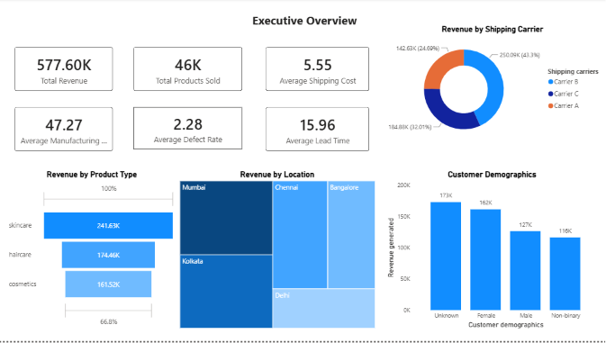
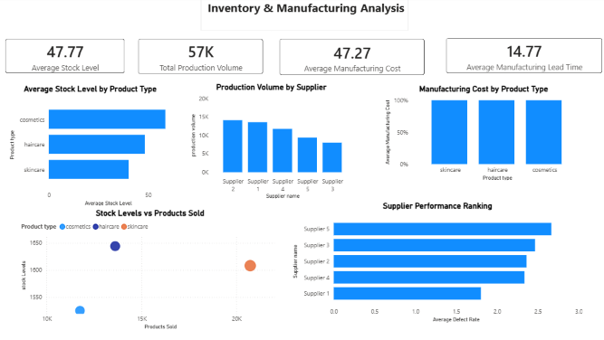
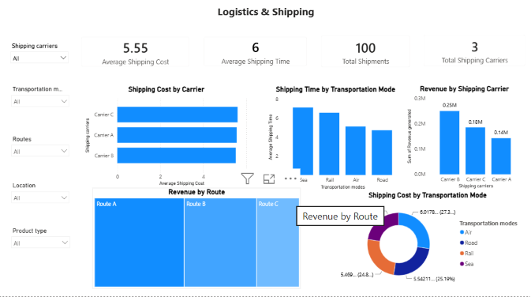
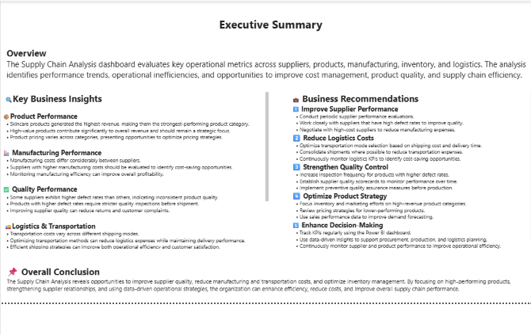

# Supply-Chain-Analysis
End-to-end Supply Chain Analysis project using Excel, Python, SQL, and Power BI to analyze production, manufacturing, inventory, logistics, and shipping performance through interactive business intelligence dashboards.

---

# 📖 Project Overview

The Supply Chain Analysis Dashboard is an end-to-end Business Intelligence project that transforms raw supply chain data into meaningful business insights using Excel, Python, SQL, and Power BI.

---

# 🎯 Business Objectives

- Analyze production performance across products and factories.
- Monitor manufacturing costs and defect rates.
- Evaluate supplier performance.
- Track inventory levels and stock movement.
- Analyze shipping costs and delivery times.
- Identify operational inefficiencies and improvement opportunities.
- Support strategic business decisions through interactive dashboards.

---

# 🛠️ Tools & Technologies

| Tool | Purpose |
|------|---------|
| 📊 Excel | Data Collection & Initial Cleaning |
| 🐍 Python (Pandas, NumPy, Matplotlib) | Data Cleaning & Exploratory Data Analysis |
| 🗄️ MySQL | Business Queries & Data Analysis |
| 📈 Power BI | Interactive Dashboard & Data Visualization |
| 📂 Git & GitHub | Version Control & Project Portfolio |

---

# 🔄 Project Workflow

Raw Dataset (Excel)

⬇️

Data Cleaning & Preprocessing (Python)

⬇️

Business Analysis (SQL)

⬇️

Interactive Dashboard Development (Power BI)

⬇️

Business Insights & Decision Making

---

# 📊 Dashboard Pages

## 🏠 Executive Overview

### KPIs
- Total Production Volume
- Total Revenue
- Average Manufacturing Cost
- Average Shipping Cost
- Average Lead Time
- Average Defect Rate

### Visualizations
- Revenue by Shipping Carrier
- Revenue by Product Type
- Revenue by Location
- Customer Demographics


---

## 🏭  Inventory & Manufacturing Analysis

### KPIs
- Average Manufacturing Cost
- Average Stock Level
- Total Production volume
- Average manufacturing Lead Time

### Visualizations
- Manufacturing Cost by Product Type
- Average stock by Product Type
- Production Volume by Supplier 
- Stock Levels Vs Products Sold
- Supplier Performance Ranking

---

## 🚚 Logistics & Shipping Analysis

### KPIs
- Average Shipping Cost
- Average Shipping Time
- Total Shipments
- Total Shipping carrier

### Visualizations
- Shipping Cost by Carrier
- Shipping Time by Transportation Mode
- Revenue By Shipping Carrier
- Revenue by Route
- Shipping cost by Transportation Mode

---
### Executive Summary
- Business Insights
- Recommendations
- Operational Conclusions

---

# 📂 Project Structure

```
Supply-Chain-Analysis
│
├── Data
│   ├── supply_chain_data.csv
│
├── Python
│   └── supply_chain_data.csv.ipynb
│
├── SQL
│   └── supply_chain_data_mysql.sql
│
├── Power BI
│   └── supply_chain_Dashboard.pbix
│
├── Screenshots
│   ├── Executive_Overview.png
│   ├── Inventory_Manufacturing.png
│   └── Logistics_Shipping.png
│   └── Executive_Summary.png
│
└── README.md
```

---

# 📸 Dashboard Preview

## Executive Overview



---

## Inventory & Manufacturing



---

## Logistics & Shipping



---

## Executive Summary




# 💼 Skills Demonstrated

- Data Cleaning
- Data Wrangling
- Exploratory Data Analysis (EDA)
- SQL Query Writing
- Business Intelligence
- Dashboard Design
- Data Visualization
- DAX Measures
- Power Query
- Business Analytics
- Supply Chain Analytics

---

# 🚀 Future Improvements

- Predictive demand forecasting using Machine Learning.
- Supplier performance scoring model.
- Inventory optimization dashboard.
- Real-time data integration.
- Automated reporting using Power BI Service.

---

# 👩‍💻 Author

**Yogita Thakur**

Aspiring Data Analyst passionate about transforming raw data into actionable business insights through analytics and visualization.

### ⭐ If you found this project helpful, don't forget to Star this repository!
